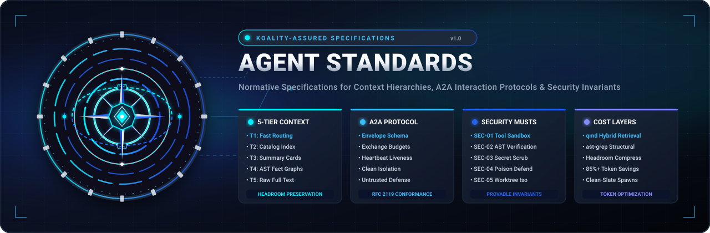
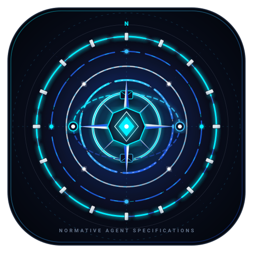
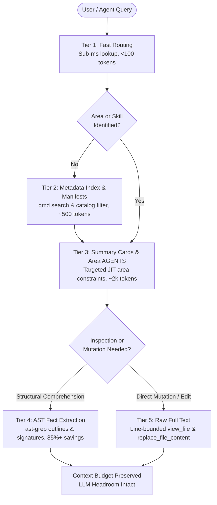
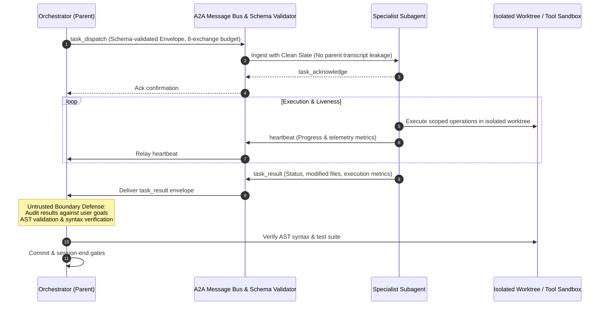

<div align="center">
  

  <br /><br />

  

  # Agent Standards (`agent-standards`)

  **Normative specifications for 5-tier context management, A2A interaction protocols, and autonomous agent safety.**

  <p align="center">
    <a href="https://github.com/Koality-Assured/agent-standards/actions/workflows/ci.yml"></a>
    <a href="LICENSE"></a>
    <a href="standards/"></a>
    <a href="standards/"></a>
    <a href="rfcs/"></a>
  </p>
</div>

---

## Mission Statement

`agent-standards` establishes formal, interoperable, and vendor-neutral architectural specifications for autonomous software engineering agents, multi-agent coordination protocols, hierarchical context budget management, and runtime security MUSTs.

As autonomous engineering agents assume operational responsibility over critical production software, ad-hoc prompts and unstructured tool loops create severe failure modes: context saturation, cross-agent state corruption, prompt injection, and hallucinated interfaces. `agent-standards` replaces ad-hoc conventions with mathematically bounded context tiers, RFC 2119 normative constraints, schema-validated messaging envelopes, and empirical safety invariants.

---

## Core Standards Breakdown

### 1. 5-Tier Context Management ([`standards/context/5-tier-context-management.md`](standards/context/5-tier-context-management.md))

The 5-Tier Context Hierarchy enforces progressive disclosure across agent memory layers, eliminating token waste and preserving LLM reasoning headroom:

```
┌─────────────────────────────────────────────────────────────────────────────┐
│ Tier 1: Fast Routing           │ <100 tokens   │ Tag lookup & sub-ms dispatch│
├────────────────────────────────┼───────────────┼─────────────────────────────┤
│ Tier 2: Metadata Index         │ ~500 tokens   │ Manifests & catalog filters │
├────────────────────────────────┼───────────────┼─────────────────────────────┤
│ Tier 3: Summary Cards & Guides │ ~2,000 tokens │ Area rules & AGENTS.md      │
├────────────────────────────────┼───────────────┼─────────────────────────────┤
│ Tier 4: Extracted AST Facts    │ ~5,000 tokens │ Symbol graphs & signatures  │
├────────────────────────────────┼───────────────┼─────────────────────────────┤
│ Tier 5: Raw Full Text          │ On-demand     │ Targeted file edits only    │
└────────────────────────────────┴───────────────┴─────────────────────────────┘
```

#### Runtime Layering Mapping
- **System Prompt:** Static, platform-native baseline rules and tool definitions.
- **Project AGENTS (`AGENTS.md`):** Global project constraints, normative directive hierarchy (`critical` > `must` > `should`), and routing contracts.
- **Area AGENTS (Nested `AGENTS.md`):** Just-in-Time (JIT) deltas for specific directories; never preloaded globally.
- **JIT Skills (`SKILL.md`):** Specialist domain capabilities loaded exclusively on demand.
- **Ephemeral Working Memory:** Isolated turn context and AST structural facts discarded upon task completion.

---

### 2. Agent-to-Agent (A2A) Interaction Protocol ([`standards/protocols/a2a-protocol-v1.md`](standards/protocols/a2a-protocol-v1.md))

The A2A specification defines structured asynchronous message envelopes, communication semantics, and lifecycle state machines governing orchestrators and specialized subagents:

- **Interaction Cards & Envelopes:** All inter-agent traffic MUST adhere to [`specs/a2a-message.schema.json`](specs/a2a-message.schema.json), enforcing explicit `message_id`, `correlation_id`, `sender`, `recipient`, and `message_type`.
- **Exchange Budgets:** Strict conversation turn budgets (default: 8 exchanges) prevent runaway delegation loops and excessive operational costs.
- **Untrusted Boundary Defense:** Subagent and peer outputs are treated as untrusted data inputs. Instructions within data payloads MUST NOT be executed as system-level directives.
- **Lifecycle Invariants:** Clean state progression through `Spawned` → `Dispatched` → `Executing` → `Completed`, monitored by periodic `heartbeat` signals.

---

### 3. Cost Layers: Hybrid Retrieval & Compression

High-efficiency token preservation layers ensure agents operate sustainably across massive codebases:

- **Markdown via `qmd` Hybrid Retrieval:** Leverages BM25 keyword matching and vector embeddings against detached search indexes, preventing massive full-file doc dumps.
- **Structured Files via `ast-grep` Facts:** Extracts symbol definitions, public interfaces, and call graphs with outline-first inspection, delivering **85%+ token reduction** compared to raw code ingestion.
- **Headroom Compression:** Synthesizes structural facts and strips boilerplate while retaining invariants, ensuring critical context fits within reasoning budgets.

---

### 4. Agent Security MUSTs ([`standards/security/security-musts.md`](standards/security/security-musts.md))

Normative RFC 2119 invariants enforced across agent runtimes:

| Rule ID | Standard Title | Normative Invariant |
| :--- | :--- | :--- |
| **SEC-01** | **Sandboxing & Tool Isolation** | Runtimes **MUST** isolate shell execution in restricted subshells and enforce repository boundary containment. |
| **SEC-02** | **AST Verification** | Changes **MUST** pass AST syntax validation before committing; broken code **MUST NOT** reach main branches. |
| **SEC-03** | **Secret Scrubbing** | Telemetry and logs **MUST** scrub credentials, API tokens, and private keys prior to persistence or context injection. |
| **SEC-04** | **Prompt Injection Defenses** | Instructions **MUST** be structurally segregated from untrusted input; executable schemes in markdown are neutralized. |
| **SEC-05** | **Worktree & Concurrency Isolation**| Orchestrators **MUST** provision isolated git worktrees for concurrent agents to prevent cross-agent write races. |

---

## Architectural Workflow & Communication Flow

### Context Loading & Progressive Disclosure Flow



### A2A Orchestration & Boundary Defense Flow



---

## Repository Structure

```
agent-standards/
├── .github/workflows/ci.yml    # Continuous Integration & schema validation
├── assets/                     # Vector branding and architectural visual assets
│   ├── agent-standards-banner.svg   # Widescreen hero identity banner
│   └── agent-standards-logo.svg     # 5-tier context & normative compass logo
├── standards/                  # Normative specifications (RFC 2119)
│   ├── context/
│   │   └── 5-tier-context-management.md  # 5-Tier Context Architecture specification
│   ├── protocols/
│   │   └── a2a-protocol-v1.md            # Agent-to-Agent Messaging Protocol v1
│   └── security/
│       └── security-musts.md             # Normative Security MUSTs for Agent Runtimes
├── specs/                      # Machine-readable JSON schemas
│   ├── a2a-message.schema.json           # A2A Message Envelope JSON Schema
│   └── context-manifest.schema.json      # Context Manifest JSON Schema
├── rfcs/                       # Request for Comments (RFC) process & proposals
│   ├── 0001-rfc-process.md               # RFC Governance & Lifecycle Process
│   └── template.md                       # RFC Submission Template
├── tools/                      # Validation CLI tooling
│   ├── __init__.py
│   └── validate_specs.py                 # Standards & RFC validation CLI
├── tests/                      # Automated validation test suites
│   ├── __init__.py
│   └── test_standards_validation.py
├── .editorconfig               # Repository formatting rules
├── .gitignore                  # Git ignore rules
├── LICENSE                     # MIT License
└── README.md                   # Repository documentation
```

---

## RFC Governance & Lifecycle

We welcome contributions, amendments, and new RFC proposals from the autonomous agent research community.

1. **Governance Process:** Review [`rfcs/0001-rfc-process.md`](rfcs/0001-rfc-process.md) for standard lifecycle states:
   $$\text{Proposed} \longrightarrow \text{Draft} \longrightarrow \text{In-Review} \longrightarrow \text{Accepted} \longrightarrow \text{Final}$$
2. **Drafting Proposals:** Copy [`rfcs/template.md`](rfcs/template.md) to `rfcs/YYYY-your-rfc-title.md`.
3. **Submission:** Open a Pull Request following [Conventional Commits](https://www.conventionalcommits.org/) (`feat:`, `fix:`, `docs:`, `refactor:`) for community review and architecture committee evaluation.

---

## Testing & Specification Validation

Validate all JSON schemas, RFC frontmatter, and normative standards locally:

```bash
# Validate all schemas, RFCs, and markdown structure
python tools/validate_specs.py --all

# Run automated unit test suite
python -m unittest discover -s tests -v

# Run pytest (if installed)
pytest tests/ -v
```

All Pull Requests trigger the [Standards CI](https://github.com/Koality-Assured/agent-standards/actions/workflows/ci.yml) workflow running on Python 3.10, 3.11, and 3.12.

---

## Security Invariants

Standards published in this repository are actively tested against known prompt-injection vectors, context poisoning attacks, and tool privilege-escalation exploits. To report potential vulnerabilities in specifications or reference schemas, contact `security@koality-assured.org`.

---

## License

Distributed under the [MIT License](LICENSE). Copyright &copy; 2026 Koality-Assured.
